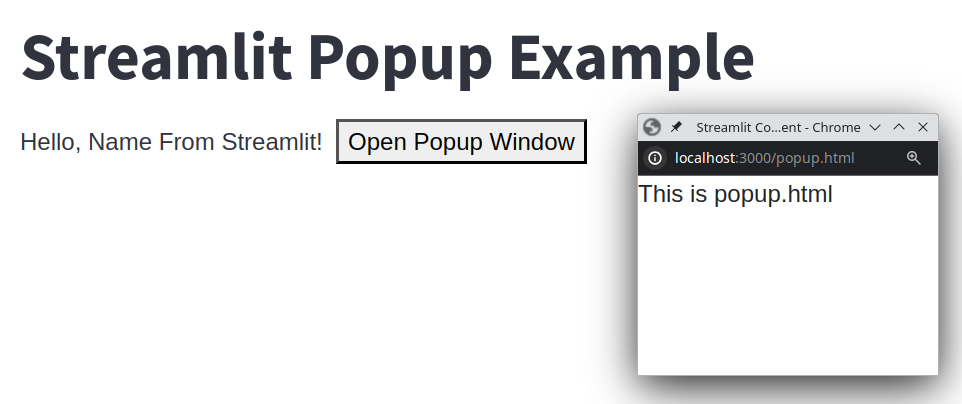

# test_streamlit_component



## 목적
- Streamlit에서 custom component를 만든다

## Install
### clone
```bash
git clone https://github.com/halfenif/test_streamlit_component.git
```

### Python Venv
```bash
python -m venve venv
. venv/bin/activate
./install.sh
```

### NPM
```bash
cd my_component/frontend
npm install
npm build
npm run start
```

### Streamlit
```bash
streamlit run app.py

```

## Config
config url or file : my_component/\_\_init__.py
> Streamlit이 custom component를 호출 할 때 사용할 url 혹은 build된 html file

Streamlit.setComponentReady() : my_component/frontend/src/index.tsx
> HTML(Script)에서 setComponentReady()가 호출되어야 한다.

## 기타
- 처음 시작은 streamlit으로 만들어진 google oauth컴포넌트였다
- 컴포넌트를 조작하다가 보면 Popup Window가 생성하는데 이것이 Streamlit의 컴포넌트가 하는 것인지 내부적(예, httpx-oauth)으로 뭔가가 하는 것인지 알수가 없었다.
- 결국 Streamlit custom component를 하나 만들어보고나서야 이해하게 된다.
